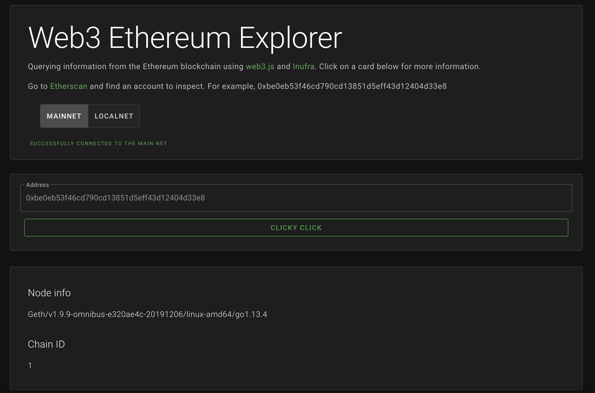

# Web3 Explorer

Ethereum blockchain explorer made with [Vue.js](https://vuejs.org/) and [Web3.js](https://web3js.readthedocs.io/en/v1.2.0/)

## To run locally

`npm install`

`npm run serve`

# About

The purpose of this page is to test the basic connectivity and functionality of [Web3.js](https://web3js.readthedocs.io/en/v1.2.0/)

### Mainnet

By selecting the 'mainnet' option, we can look up accounts on the main ethereum blockchain. Accounts can be found on [Etherscan](https://etherscan.io). We can also use the information on Etherscan to check the validity of the information displayed. Exploring the mainnet doesn't require any additional set up.

### Local net

The local net option allows us to inspect accounts on a locally hosted blockchain.
It requires a few steps to set up.

1. Start a local node on [Ganache](https://www.trufflesuite.com/ganache)
2. In the browser, connect [MetaMask](https://medium.com/@seanschoi/what-is-metamask-really-what-is-it-7bc1bf48c75) to the correct localhost port
3. Deploy a smart contract onto the local blockchain from [Remix](https://remix-ide.readthedocs.io/en/latest/).
4. Copy an address from Ganache and paste it into Web3 explorer

---

## Web3.js API calls used

| Method                       |                                                                                                                                                                                             Description |
| :--------------------------- | ------------------------------------------------------------------------------------------------------------------------------------------------------------------------------------------------------: |
| web3.eth.getNodeInfo         |                                                                                                                                                                     Returns the current client version. |
| web3.eth.getChainId          |                                                                                                                                                                            Returns the current chainId. |
| web3.eth.getBalance          |                                                                                                                        Get the balance of an address at a given block. By default, use the latest block |
| web3.eth.getGasPrice         |                                                                                              Returns the current gas price oracle. The gas price is determined by the last few blocks median gas price. |
| web3.eth.getAccounts         |                                                                                                                                                           Returns a list of accounts the node controls. |
| web3.eth.getBlockNumber      |                                                                                                                                                                       Returns the current block number. |
| web3.eth.getTransactionCount |                                                                                                                                                 Get the numbers of transactions sent from this address. |
| state.web3.eth.getHashrate   |                                                                                                                                   Returns the number of hashes per second that the node is mining with. |
| state.web3.utils.fromWei     | Converts any wei value to an wther value. By default, all monetary values are displayed in wei. Wei is the smallest unit of ether (similar to cents and dollars). One wei is 0.000000000000000001 ether |
| state.web3.utils.isAddress   |                                                                  Checks if a given string is a valid Ethereum address. It will also check the checksum, if the address has upper and lowercase letters. |

---

## Infura

[Infura](https://www.trufflesuite.com/tutorials/using-infura-custom-provider) is a hosted Ethereum node cluster that lets your users run your application without requiring them to set up their own Ethereum node or wallet. You may not be familiar with Infura by name, but if you've used MetaMask then you've used Infura, as it is the Ethereum provider that powers MetaMask. Click here for more info.

## MetaMask

[MetaMask](https://medium.com/@seanschoi/what-is-metamask-really-what-is-it-7bc1bf48c75) is a bridge that allows you to visit the distributed web of tomorrow in your browser today. It allows you to run Ethereum dApps right in your browser without running a full Ethereum node. Click here for more info.

## Ganache

[Ganache](https://www.trufflesuite.com/ganache) is a personal blockchain for rapid Ethereum and Corda distributed application development. You can use Ganache across the entire development cycle; enabling you to develop, deploy, and test your dApps in a safe and deterministic environment. Click here for more info.

## Remix

[Remix](https://remix-ide.readthedocs.io/en/latest/) is a powerful, open source tool that helps you write Solidity contracts straight from the browser. Written in JavaScript, Remix supports both usage in the browser and locally. Remix also supports testing, debugging and deploying of smart contracts and much more. Click here for more info.
